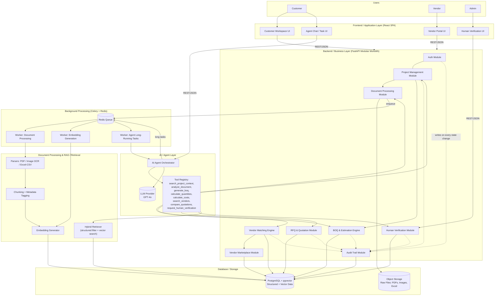
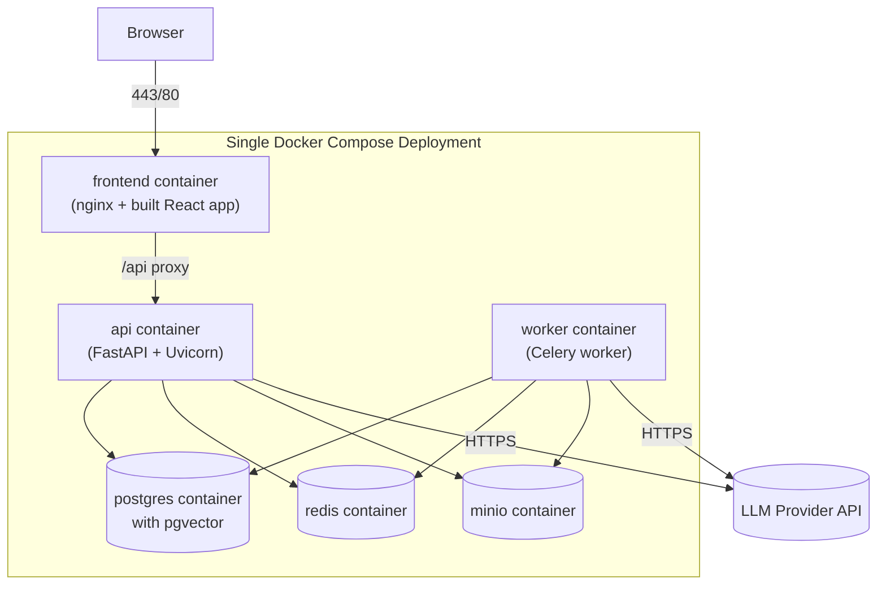

# 1. System Architecture

## 1.1 Design Principles

- **Modular monolith, not microservices.** A single deployable backend with clearly separated internal modules. Microservices would add network overhead, deployment complexity, and coordination cost that a 4-person, 3–4 month team cannot absorb.
- **One relational database for everything, including vectors.** PostgreSQL + the `pgvector` extension stores structured data *and* embeddings in the same database. This avoids running/operating a separate vector database (Pinecone/Weaviate/Milvus) and keeps referential integrity (a vector chunk can `JOIN` directly to its source document).
- **AI proposes, code disposes.** LLMs handle language understanding, extraction, classification, and semantic search. All arithmetic (areas, volumes, counts, costs) is done by a deterministic Python calculation module.
- **Everything asynchronous that can be slow.** Document parsing, OCR, embedding generation, and LLM calls run as background jobs so the web layer stays responsive.
- **Every AI-touched record has confidence + provenance.** This is what makes uncertainty detection, audit trail, and human verification possible — it's a cross-cutting concern baked into the data model, not a bolt-on feature.

## 1.2 Technology Stack

| Layer | Technology | Why |
|---|---|---|
| Frontend | React + TypeScript + Vite, TailwindCSS, React Query | Fast to build, huge ecosystem, easy for students to split screens across 2 people |
| Backend API | Python 3.11 + FastAPI | Same language as AI/document processing code → one team skill set, async-native, auto OpenAPI docs |
| Background workers | Celery (or RQ) + Redis broker | Mature, simple job queue for document processing, embedding, and long agent runs |
| Database | PostgreSQL 15 + `pgvector` extension | Relational + vector search in one engine; no extra infra |
| File storage | S3-compatible object storage (MinIO locally / AWS S3 in prod) | Standard pattern for storing uploaded PDFs/images/Excel files |
| Cache / Queue broker | Redis | Job queue + simple caching (e.g., vendor search results) |
| LLM provider | OpenAI GPT-4o / GPT-4o-mini (swappable via an `LLMClient` interface) | Strong multimodal (vision) support for drawings/images, function/tool calling |
| Embeddings | OpenAI `text-embedding-3-small` (swappable) | Cheap, fast, good enough quality for MVP semantic search |
| Document parsing | `PyMuPDF`/`pdfplumber` (PDF text), `pytesseract` or GPT-4o vision (scanned/image), `openpyxl`/`pandas` (Excel/CSV) | Covers the MVP's declared document types |
| Auth | JWT-based auth, role field on `users` (customer / vendor / admin) | Simple, no need for a separate identity service |
| Deployment | Docker Compose (single VM or student cloud credits) | One `docker-compose.yml` runs API, worker, Postgres, Redis, MinIO, frontend — realistic for a student demo and grading |
| Observability (minimal) | Structured logging + `audit_logs` table + basic request logging | Full observability stacks (Prometheus/Grafana) are out of scope |

> The LLM/embedding clients are wrapped behind thin interfaces (`LLMClient`, `EmbeddingClient`) so the provider can be swapped (e.g., to a local/open model) without touching business logic — useful if API costs become a concern during the project.

## 1.3 Overall Architecture Diagram

## 1.4 Customer Workflow — Data Flow

```mermaid
flowchart LR
    A[Create Project] --> B[Upload Drawings/Docs/BOQ/Images]
    B --> C[Document Processing:\nparse, OCR, chunk, embed]
    C --> D[AI Agent: analyze_document +\nsearch_project_context]
    D --> E[Extracted Requirements\nstored w/ confidence + source]
    E --> F[generate_boq tool →\nPreliminary BOQ]
    F --> G["calculate_quantities +\ncalculate_costs\n(deterministic engine)"]
    G --> H{Uncertainty\nDetected?}
    H -- Yes --> I[Human Verification Queue]
    H -- No --> J[search_vendors →\nVendor Matching Engine]
    I -->|Corrections/Approval| G
    J --> K[Generate RFQ]
    K --> L[Vendors Submit Quotations]
    L --> M[compare_quotations tool]
    M --> N[Customer Reviews &\nApproves Vendor]
```

## 1.5 Vendor Workflow — Data Flow

```mermaid
flowchart LR
    A2[Register Vendor] --> B2[Create Vendor Profile]
    B2 --> C2[Upload BOQ / Product /\nService Documents]
    C2 --> D2[Document Processing:\nparse, OCR, chunk]
    D2 --> E2[AI Extraction:\nitem, category, spec,\nunit, qty, price]
    E2 --> F2[Standardize & Validate\ninto vendor_catalog_items]
    F2 --> G2[Generate Embeddings]
    G2 --> H2[Publish to Marketplace]
    H2 --> I2["Receive Relevant RFQs\n(via Vendor Matching Engine)"]
    I2 --> J2[Submit Quotation]
```

## 1.6 Deployment View (MVP)

This is deliberately a single-VM-friendly deployment (or student cloud free tier). No Kubernetes, no service mesh, no multi-region — all explicitly out of scope (see [08-estimation-plan.md](./08-estimation-plan.md)).

## 1.7 System Boundaries

| Boundary | Inside MVP | Outside MVP |
|---|---|---|
| Document types | PDF, images (JPG/PNG), Excel/CSV | Revit/IFC/BIM, CAD-native (DWG) |
| Users | Customer, Vendor, Admin | Multi-org enterprise tenancy, SSO |
| Money | AI estimate (indicative), vendor quotation (indicative) | Real payment processing, escrow |
| Vendor discovery | Marketplace + structured filter + semantic match | Real-time inventory sync, ERP integration |
| Agent | Single orchestrator + tool registry | Multi-agent negotiation, autonomous purchasing |

Continue to [02-hld.md](./02-hld.md) for module-level responsibilities.
