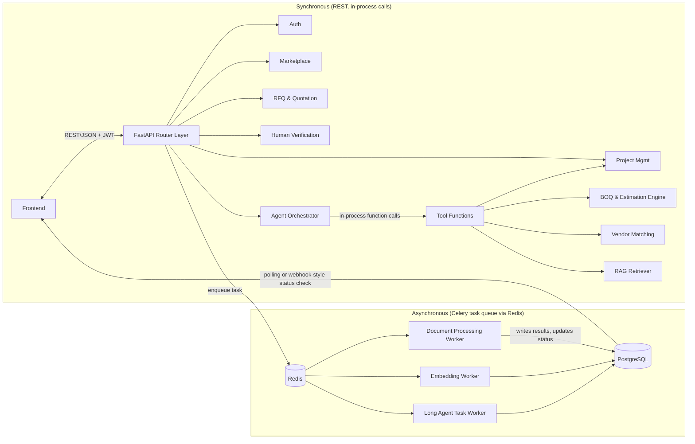
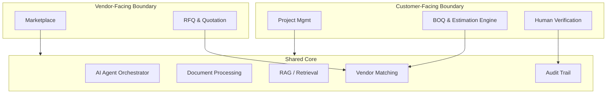

# 2. High-Level Design (HLD)

## 2.1 Module List

| Module | Responsibility |
|---|---|
| **Auth** | User registration/login, JWT issuance, role-based access (customer / vendor / admin) |
| **Project Management** | CRUD for customer projects, project status/lifecycle, ownership |
| **Document Processing** | Accept uploads (customer & vendor), store raw files, parse/OCR, chunk text, hand off to embedding pipeline |
| **RAG / Retrieval** | Chunk storage with embeddings, hybrid retrieval (metadata filter + vector similarity), citation metadata |
| **BOQ & Estimation Engine** | Deterministic calculation of quantities/areas/volumes/counts and costs from extracted requirements + reference rates; produces `boqs`, `boq_items`, `estimates` |
| **AI Agent Orchestrator** | Interprets user/system requests, plans steps, selects & calls tools, validates results, decides on escalation |
| **Vendor Marketplace** | Vendor profile management, catalog storage (`vendor_catalog_items`), publishing |
| **Vendor Matching Engine** | Combines structured filters (category, spec, quantity, budget, location) with semantic similarity to rank vendors/items per requirement |
| **RFQ & Quotation** | Generate RFQs from a BOQ, distribute to matched vendors, collect/store quotations, structure quotation comparison |
| **Human Verification** | Surface low-confidence/ambiguous items, capture corrections/approvals/rejections, feed corrections back into the record |
| **Audit Trail** | Append-only log of every AI decision, calculation, match, and human action, with source references |
| **Background Jobs** | Celery task runner for document parsing, embedding generation, long-running agent tasks, RFQ notifications |

## 2.2 Module Communication

- **Frontend ↔ Backend:** REST over HTTPS, JSON payloads, JWT bearer auth. All modules exposed through FastAPI routers under a single API surface (e.g. `/api/projects`, `/api/vendors`, `/api/agent`, `/api/rfqs`).
- **Backend ↔ Agent:** In-process Python calls. The agent is a Python module inside the same FastAPI app — no network hop, no separate service.
- **Agent ↔ Tools:** Tools are plain Python functions/classes registered in a `ToolRegistry`. The agent calls them directly (function calling pattern from the LLM maps to real Python function invocation).
- **Backend ↔ Background Workers:** Celery tasks enqueued via Redis. Used for anything that can take >1–2 seconds: document parsing, OCR, embedding, and any agent run flagged as "long" (e.g., full-document BOQ generation on a large project).
- **Status updates back to frontend:** Simple polling (`GET /api/documents/{id}/status`) is sufficient for MVP. WebSockets/SSE are a "Should Have" (see [08-estimation-plan.md](./08-estimation-plan.md)) if time allows, not a requirement.

## 2.3 Main Data Flows

1. **Requirement extraction flow:** `project_documents` → (Document Processing) → `document_chunks` (+embeddings) → (Agent: `analyze_document`, `search_project_context`) → `extracted_requirements` (with `confidence_score`, `source_document_id`, `source_chunk_id`).
2. **Estimation flow:** `extracted_requirements` → (Agent: `generate_boq`) → `boqs` + `boq_items` → (Agent: `calculate_quantities`, `calculate_costs` — deterministic engine, no LLM) → `estimates` + `estimate_line_items`.
3. **Uncertainty flow:** Any extraction/calculation step below a confidence threshold, or with missing required inputs, writes an `uncertainty_flags` row and (optionally) triggers `request_human_verification`.
4. **Vendor catalog flow:** `vendor_documents` → (Document Processing) → AI extraction → `vendor_catalog_items` (structured, normalized) + embeddings.
5. **Vendor matching flow:** `boq_items`/`extracted_requirements` → (Agent: `search_vendors`) → Vendor Matching Engine (structured filter over `vendor_catalog_items` + vector similarity) → ranked candidate list → surfaced in UI.
6. **RFQ flow:** Customer selects BOQ items + candidate vendors → `rfqs` + `rfq_line_items` created → vendors notified (in-app) → vendors submit `quotations` + `quotation_line_items` → (Agent: `compare_quotations`) → comparison view.
7. **Human verification flow:** `uncertainty_flags` / low-confidence `extracted_requirements` / `boq_items` / vendor matches → shown in Human Verification UI → user edits/approves/rejects → `approvals` row written → source record updated + `audit_logs` entry written.
8. **Audit flow:** Every write in flows 1–7 that resulted from an AI decision or a human action also writes one `audit_logs` row capturing actor, action, source, confidence, and before/after values.

## 2.4 System Boundaries (Module-Level)

The **Shared Core** is intentionally where most of the academic/technical value lives (agent, RAG, matching). Customer-side and vendor-side modules are thinner CRUD + workflow layers built on top of it — this lets two team members work on "customer side" and "vendor side" screens/APIs largely in parallel while two others build the shared core.

## 2.5 Synchronous vs Asynchronous Processes

| Process | Sync or Async | Reason |
|---|---|---|
| Login/auth | Sync | Fast, must block UI |
| Create/edit project | Sync | Simple CRUD |
| File upload (accept + store) | Sync (upload) → Async (processing) | Upload itself is quick; parsing/OCR/embedding is slow |
| Document parsing/OCR | **Async** (Celery) | Can take seconds–minutes per file, especially OCR/vision |
| Embedding generation | **Async** (Celery) | Batchable, latency-tolerant |
| Agent short queries (chat Q&A, retrieval-only) | Sync | Sub-second to few-second LLM round trip is acceptable in a request/response |
| Agent full BOQ generation on a large project | **Async** (Celery), with status polling | Multiple tool calls + LLM round trips can exceed typical HTTP timeout |
| Quantity/cost calculation | Sync | Pure deterministic Python, fast |
| Vendor search/matching | Sync (small catalogs) | pgvector queries at MVP scale are fast; async only if catalog grows large |
| RFQ creation & distribution | Sync (create) → Async (notify) | Creating RFQ rows is fast; notification fan-out to many vendors can be async |
| Quotation comparison | Sync | Reads existing rows, light LLM summarization at most |
| Human verification actions (approve/correct) | Sync | Must feel immediate to the user |

## 2.6 AI Responsibilities vs Deterministic Business Logic

| Responsibility | Owner | Notes |
|---|---|---|
| Understand document content (text/vision) | **AI (LLM)** | GPT-4o multimodal for drawings/images, text extraction for PDFs |
| Classify construction items/components | **AI (LLM)** | Maps free text/labels to a controlled vocabulary of item categories |
| Extract raw dimensions/quantities/specs from documents | **AI (LLM)**, with confidence score | Never trusted blindly — flows into `extracted_requirements` with confidence |
| Decide what tool to call next | **AI (Agent)** | Planning loop, see [05-ai-agent-design.md](./05-ai-agent-design.md) |
| Compute area/volume/length/count from dimensions | **Deterministic code** | Pure formulas in BOQ & Estimation Engine |
| Compute costs from quantities × rates | **Deterministic code** | Uses a configurable rate table, not LLM guesses |
| Decide if a value is "uncertain" | **Deterministic rule + AI confidence** | Threshold-based rules combined with the LLM's own confidence signal |
| Filter vendors by hard constraints (category, spec match, in-stock/quantity, budget cap, location) | **Deterministic code** | SQL/structured filtering |
| Rank filtered vendors by semantic relevance | **AI (embeddings + LLM re-rank, optional)** | Applied only *after* deterministic filtering narrows the candidate set |
| Summarize/compare quotations for the user | **AI (LLM)**, over deterministic diff | The diff (price, spec, delivery) is computed in code; the LLM writes the human-readable summary |
| Final approval of any estimate, match, or quotation choice | **Human** | Non-negotiable — AI never finalizes a decision autonomously |

## 2.7 Human Involvement Points

1. **Reviewing extracted requirements** flagged with low confidence or missing fields.
2. **Approving/adjusting the preliminary BOQ** before it's used for vendor search or shown as "final" to the customer.
3. **Approving vendor matches** before an RFQ is sent.
4. **Selecting the winning vendor/quotation** — the system never auto-selects.
5. **Vendor-side review** of AI-extracted catalog items before publishing to the marketplace (prevents garbage-in from OCR errors).
6. **Admin-level oversight** (optional, Should Have): reviewing flagged/ambiguous cases across projects.

Continue to [03-lld.md](./03-lld.md) for internal module design and sequence diagrams.
