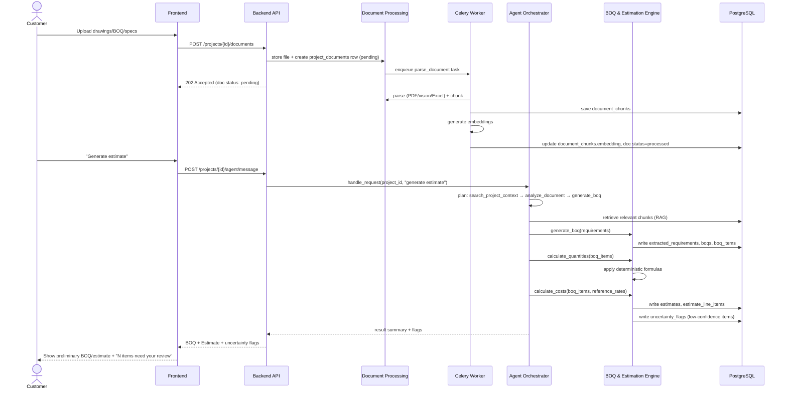
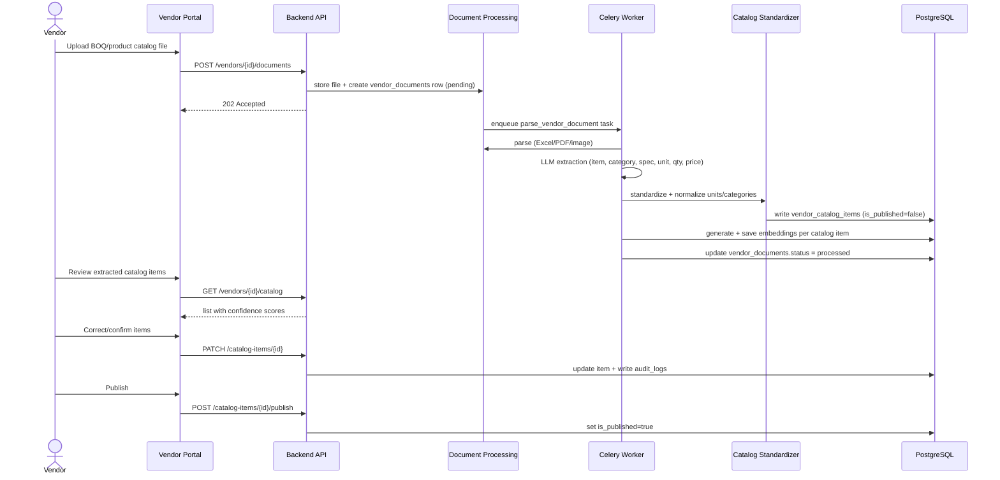
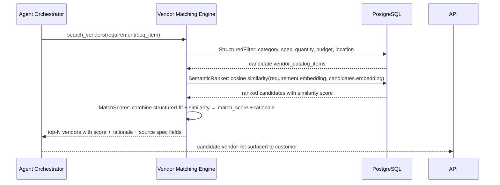
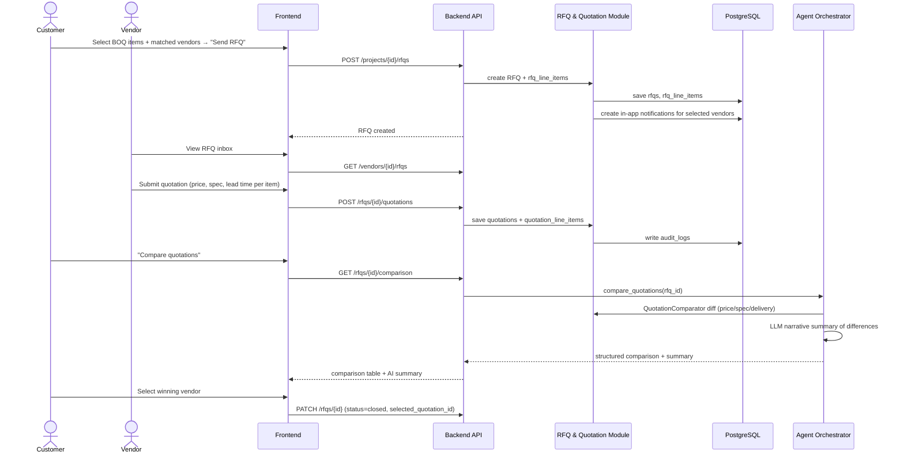
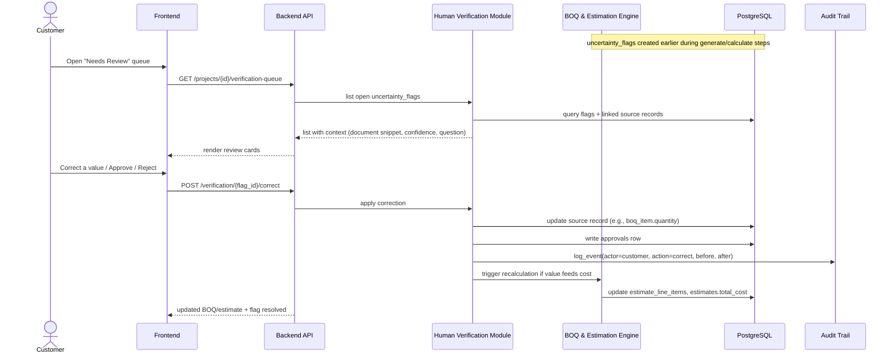
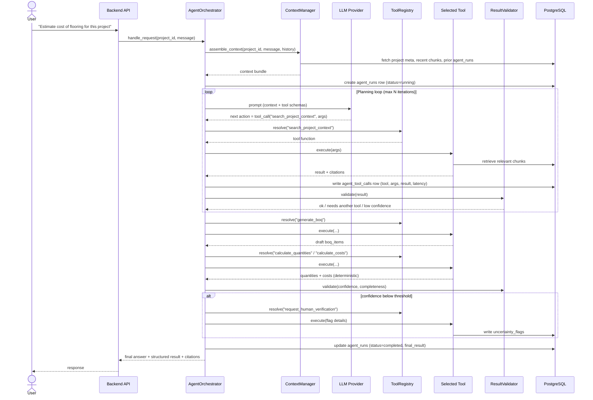

# 3. Low-Level Design (LLD)

Backend is a single FastAPI codebase organized by module (folder-per-module, e.g. `app/modules/boq/`, `app/modules/agent/`). Each module below lists its internal components, key classes, main entities touched, its REST interface, and its main operations.

---

## 3.1 Auth Module

**Internal components:** `AuthService`, `PasswordHasher`, `JWTHandler`, `RoleChecker` (FastAPI dependency).

**Entities:** `users`.

**Interface (REST):**
- `POST /api/auth/register` (role: customer|vendor)
- `POST /api/auth/login` → JWT
- `GET /api/auth/me`

**Operations:** register, login, issue/refresh token, role-based route guarding via dependency injection (`Depends(require_role("vendor"))`).

---

## 3.2 Project Management Module

**Internal components:** `ProjectService`, `ProjectRepository`.

**Entities:** `projects`.

**Interface:**
- `POST /api/projects`
- `GET /api/projects/{id}`
- `GET /api/projects?owner=me`
- `PATCH /api/projects/{id}` (status, metadata)

**Operations:** create project, update status (`draft → analyzing → estimated → sourcing → quoted → closed`), list projects for a customer.

---

## 3.3 Document Processing Module

**Internal components:**
- `DocumentUploadService` — accepts multipart upload, stores raw file in object storage, creates `project_documents`/`vendor_documents` row with status `pending`.
- `ParserFactory` — returns the correct parser based on file type:
  - `PdfTextParser` (PyMuPDF/pdfplumber)
  - `ImageVisionParser` (GPT-4o vision / OCR fallback via pytesseract)
  - `ExcelCsvParser` (openpyxl/pandas → tabular rows)
- `Chunker` — splits parsed text/tables into semantically coherent chunks (~500–800 tokens) with metadata (page number, sheet/row range, section heading if detectable).
- `DocumentProcessingTask` (Celery task) — orchestrates: parse → chunk → enqueue embedding.

**Entities:** `project_documents`, `vendor_documents`, `document_chunks`.

**Interface:**
- `POST /api/projects/{project_id}/documents` (multipart upload)
- `GET /api/projects/{project_id}/documents/{doc_id}` (status: `pending|processing|processed|failed`)
- `POST /api/vendors/{vendor_id}/documents` (same pattern for vendor side)

**Operations:** upload, enqueue processing, parse, chunk, mark processed/failed, expose parsed chunk list for debugging.

---

## 3.4 RAG / Retrieval Module

**Internal components:**
- `EmbeddingService` — wraps the embedding provider, batches requests, writes vectors into `document_chunks.embedding` (pgvector column) and `vendor_catalog_items.embedding`.
- `HybridRetriever` — given a query + filters (project_id, document type, vendor category, etc.), performs: (1) SQL filter on metadata, (2) `pgvector` cosine similarity search (`ORDER BY embedding <=> query_embedding LIMIT k`), (3) returns chunks with source references.
- `CitationBuilder` — attaches `{document_id, page/section, chunk_id}` to every retrieved chunk so downstream consumers (agent, UI) can show "source".

**Entities:** `document_chunks`, `vendor_catalog_items` (embedding column).

**Interface:** Internal only (called by Agent tools), no direct public REST endpoint except an optional debug endpoint `GET /api/debug/retrieve?query=...&project_id=...`.

**Operations:** embed chunk(s), embed query, similarity search, filtered similarity search, citation attachment. See full detail in [06-rag-design.md](./06-rag-design.md).

---

## 3.5 BOQ & Estimation Engine

**Internal components:**
- `BOQGenerator` — takes `extracted_requirements` for a project and produces a draft `boqs`/`boq_items` structure, mapping requirements to a controlled **item catalog** (`reference_items` lookup table: standard construction items with unit + default formula type).
- `QuantityCalculator` — deterministic formula library:
  - Area = length × width
  - Volume = length × width × height (or area × thickness)
  - Count-based items (doors, windows, fixtures) = direct count from extraction
  - Length-based items (piping, wiring, skirting) = perimeter/route length
- `CostCalculator` — quantity × unit_rate (from a configurable `reference_rates` table, editable by admin), producing `estimate_line_items`; sums to `estimates.total_cost`.
- `ConfidencePropagator` — combines the confidence of each contributing `extracted_requirements` row into a computed confidence for the resulting `boq_item`/`estimate_line_item`, and writes `uncertainty_flags` when below threshold or when required inputs are missing.

**Entities:** `boqs`, `boq_items`, `estimates`, `estimate_line_items`, `uncertainty_flags`, plus reference tables `reference_items`, `reference_rates`.

**Interface:**
- `POST /api/projects/{project_id}/boq/generate` (triggers agent → `generate_boq` tool)
- `GET /api/projects/{project_id}/boq`
- `PATCH /api/boq-items/{id}` (human correction)
- `POST /api/projects/{project_id}/estimate/calculate`
- `GET /api/projects/{project_id}/estimate`

**Operations:** generate BOQ draft, calculate quantities, calculate costs, recalculate on correction (progressive refinement), flag uncertainty.

---

## 3.6 Vendor Marketplace Module

**Internal components:** `VendorProfileService`, `CatalogExtractionService` (reuses Document Processing + an LLM extraction prompt tuned for catalogs/BOQs), `CatalogStandardizer` (maps extracted rows to `vendor_catalog_items` with normalized `unit`, `category`).

**Entities:** `vendors`, `vendor_documents`, `vendor_catalog_items`.

**Interface:**
- `POST /api/vendors` (create profile)
- `POST /api/vendors/{id}/documents` (upload catalog/BOQ/pricing doc)
- `GET /api/vendors/{id}/catalog` (review extracted items before publish)
- `PATCH /api/catalog-items/{id}` (vendor correction)
- `POST /api/catalog-items/{id}/publish`

**Operations:** create/update profile, upload catalog docs, trigger extraction, review/correct extracted items, publish to marketplace (sets `is_published=true`, generates/refreshes embedding).

---

## 3.7 Vendor Matching Engine

**Internal components:**
- `StructuredFilter` — SQL-level filter: category match, spec compatibility (rule-based comparison of key spec fields), quantity availability, price ≤ budget, optional location/delivery filter.
- `SemanticRanker` — vector similarity between the requirement's embedding and filtered `vendor_catalog_items.embedding`, used to rank/tiebreak within the structured-filtered set (not as the sole selector).
- `MatchScorer` — combines structured-fit score + semantic similarity + optional LLM re-rank explanation into a final `match_score` and human-readable rationale.

**Entities:** reads `boq_items`/`extracted_requirements`, `vendor_catalog_items`; writes nothing persistent by default (match results are ephemeral per request) — optionally cached in a `vendor_matches` table if time allows (Should Have).

**Interface:** Internal, invoked via Agent tool `search_vendors`; optional direct endpoint `POST /api/projects/{project_id}/vendor-search`.

**Operations:** filter candidates, rank candidates, produce top-N with score + rationale + source spec fields used.

---

## 3.8 RFQ & Quotation Module

**Internal components:** `RFQService` (builds an RFQ from selected `boq_items` + selected vendors), `QuotationService` (vendor submits price/spec/lead-time per line item), `QuotationComparator` (deterministic diff: price delta, spec delta, missing items) + optional LLM narrative summary.

**Entities:** `rfqs`, `rfq_line_items`, `quotations`, `quotation_line_items`.

**Interface:**
- `POST /api/projects/{project_id}/rfqs` (create + select vendors)
- `GET /api/vendors/{id}/rfqs` (inbox)
- `POST /api/rfqs/{id}/quotations` (vendor submits)
- `GET /api/rfqs/{id}/comparison`

**Operations:** create RFQ, notify vendors (in-app notification row / email stub), submit quotation, compare quotations, mark RFQ closed on selection.

---

## 3.9 Human Verification Module

**Internal components:** `VerificationQueueService` (aggregates all open `uncertainty_flags` across requirements/BOQ items/vendor matches for a project), `ApprovalService` (records the human decision, applies corrections back to source record).

**Entities:** `uncertainty_flags`, `approvals`.

**Interface:**
- `GET /api/projects/{project_id}/verification-queue`
- `POST /api/verification/{flag_id}/approve`
- `POST /api/verification/{flag_id}/reject`
- `POST /api/verification/{flag_id}/correct` (payload with corrected value)

**Operations:** list pending items, approve, reject, correct (writes to source table + `approvals` + `audit_logs`, and re-triggers downstream recalculation if the corrected value feeds the BOQ/estimate).

---

## 3.10 Audit Trail Module

**Internal components:** `AuditLogger` — a single service called from every other module (via a lightweight event hook or direct call) whenever an AI decision, calculation, match, or human action occurs.

**Entities:** `audit_logs`.

**Interface:** `GET /api/projects/{project_id}/audit-log` (read-only, filterable by entity type/date).

**Operations:** `log_event(actor, action, entity_type, entity_id, source, confidence, before, after)`.

---

## 3.11 AI Agent Orchestrator

Covered in full detail in [05-ai-agent-design.md](./05-ai-agent-design.md). LLD summary:

**Internal components:** `AgentOrchestrator` (planning loop), `ToolRegistry`, `ContextManager` (assembles project context + conversation history + relevant retrieved chunks), `ResultValidator`.

**Entities:** `agent_runs`, `agent_tool_calls`.

**Interface:**
- `POST /api/projects/{project_id}/agent/message` (chat-style entry point)
- `GET /api/agent/runs/{run_id}` (status/result, for async long runs)

---

## 3.12 Sequence Diagrams

### 3.12.1 Customer Estimation Flow

### 3.12.2 Vendor BOQ Upload and Processing

### 3.12.3 Vendor Matching

### 3.12.4 RFQ and Quotation Flow

### 3.12.5 Human Verification

### 3.12.6 AI Agent Tool Orchestration

Continue to [04-database-design.md](./04-database-design.md) for the full schema backing every entity referenced above.
