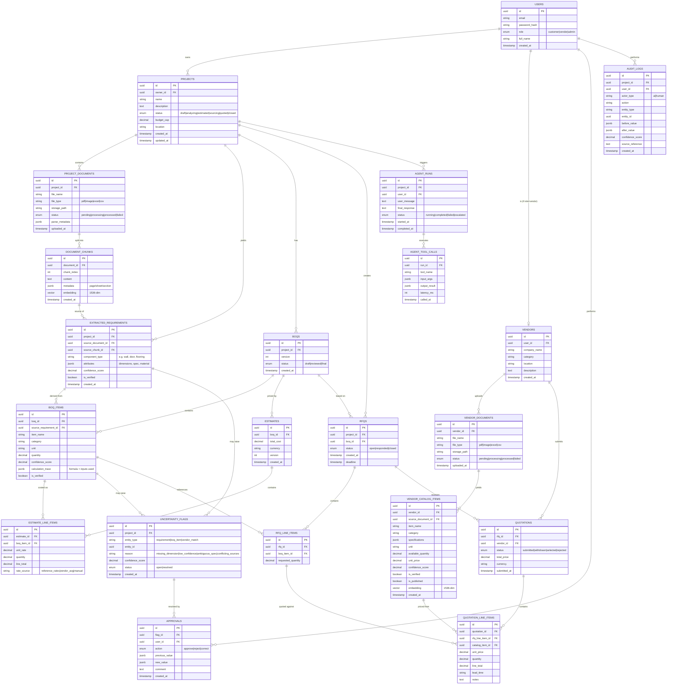

# 4. Database Design

**Engine:** PostgreSQL 15 with the `pgvector` extension (`CREATE EXTENSION vector;`). One database, one schema (`public`) is sufficient for MVP — no schema-per-tenant, no sharding.

## 4.1 ER Diagram



## 4.2 Notes on Key Tables

- **`document_chunks.embedding` and `vendor_catalog_items.embedding`** use `pgvector`'s `vector(1536)` type (matching `text-embedding-3-small`). Indexed with an HNSW or IVFFlat index for approximate nearest-neighbor search:
  ```sql
  CREATE INDEX ON document_chunks USING hnsw (embedding vector_cosine_ops);
  CREATE INDEX ON vendor_catalog_items USING hnsw (embedding vector_cosine_ops);
  ```
- **`extracted_requirements.attributes`** is `jsonb` because requirement shape varies by `component_type` (a wall has length/height/thickness; a door has count/size/material). A rigid column-per-attribute schema would not scale across item types within the project timeline.
- **`boq_items.calculation_trace`** stores the exact formula and input values used (e.g., `{"formula": "area = length * width", "inputs": {"length": 5.2, "width": 3.1}, "source_requirement_ids": [...]}`) — this is what makes the audit trail meaningful, not just a log line.
- **`uncertainty_flags`** is intentionally generic (`entity_type` + `entity_id`) rather than three separate flag tables, so the Human Verification Module and its UI can be built once and reused across requirements, BOQ items, and vendor matches.
- **`reference_items` and `reference_rates`** (not shown above, supporting/lookup tables) hold the MVP's controlled vocabulary of construction items and default unit costs — seeded manually by the team for the limited set of materials/activities the MVP supports (see [08-estimation-plan.md](./08-estimation-plan.md)).
  ```sql
  CREATE TABLE reference_items (
    id uuid PRIMARY KEY,
    item_name text NOT NULL,
    category text NOT NULL,
    unit text NOT NULL,
    default_formula text NOT NULL -- 'area' | 'volume' | 'count' | 'length'
  );
  CREATE TABLE reference_rates (
    id uuid PRIMARY KEY,
    reference_item_id uuid REFERENCES reference_items(id),
    unit_rate decimal NOT NULL,
    currency text NOT NULL DEFAULT 'USD',
    effective_date date NOT NULL
  );
  ```
- **`vendor_matches` (optional, Should Have):** if the team wants to persist/cache match results instead of recomputing every time:
  ```sql
  CREATE TABLE vendor_matches (
    id uuid PRIMARY KEY,
    boq_item_id uuid REFERENCES boq_items(id),
    catalog_item_id uuid REFERENCES vendor_catalog_items(id),
    match_score decimal,
    rationale text,
    created_at timestamp DEFAULT now()
  );
  ```
- **Estimate vs Quotation separation is structural, not just semantic:** `estimates`/`estimate_line_items` reference `boq_items` and `reference_rates` only. `quotations`/`quotation_line_items` reference `rfq_line_items` and `vendor_catalog_items` only. There is **no foreign key path from a `quotation` back into an `estimate`** — they are compared side-by-side in application logic/UI, never merged in the schema.

## 4.3 Indexing & Performance Notes (MVP-appropriate)

- Standard B-tree indexes on all foreign keys (`project_id`, `document_id`, `boq_id`, `rfq_id`, `vendor_id`).
- `vendor_catalog_items(category, is_published)` composite index for the Vendor Matching Engine's structured filter step.
- No partitioning, no read replicas, no sharding — dataset size for a student MVP (a handful of demo projects/vendors) will not require it.

Continue to [05-ai-agent-design.md](./05-ai-agent-design.md) for how the agent uses these tables.
