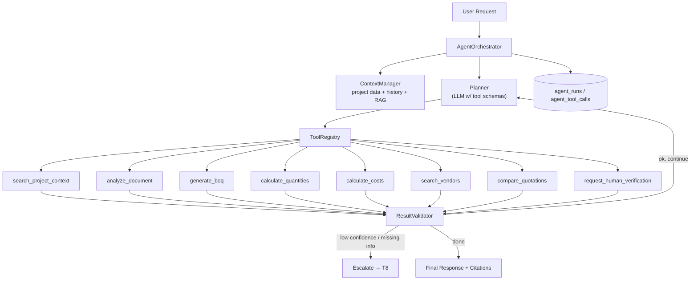
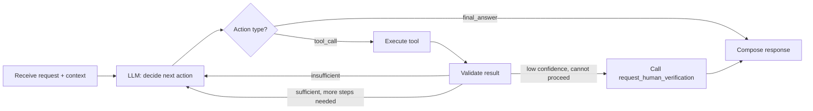
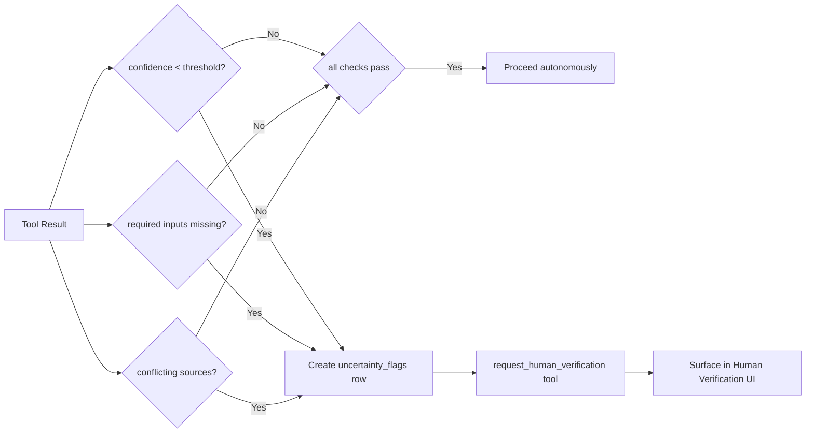

# 5. AI Agent Architecture

This is the primary academic/technical contribution of the project. The design is deliberately a **single orchestrating agent with a tool registry** — not a multi-agent framework, not agent-to-agent messaging, and not an autonomous decision-maker.

## 5.1 Responsibilities

The `AgentOrchestrator` is responsible for:

1. Interpreting a user request (chat message or a system-triggered task like "generate estimate for project X").
2. Assembling the relevant context (project metadata, prior conversation, relevant retrieved document chunks, prior agent runs).
3. Planning a sequence of tool calls to satisfy the request.
4. Selecting and invoking the correct tool(s) from the `ToolRegistry`.
5. Validating each tool's result before proceeding (confidence, completeness, consistency).
6. Deciding when to escalate to a human instead of proceeding autonomously.
7. Producing a final response (structured result + natural-language summary + citations).
8. Logging every step (`agent_runs`, `agent_tool_calls`) for the audit trail.

It is explicitly **not** responsible for: performing arithmetic itself, deciding final vendor selection, or bypassing human verification when confidence is low.

## 5.2 High-Level Agent Diagram



## 5.3 Context & Memory

The agent uses two tiers of context — no long-term "agent memory" store beyond what's already in the relational database (deliberately avoiding a separate memory system for MVP):

| Tier | Contents | Source |
|---|---|---|
| **Short-term (per-run)** | Current user message, last N turns of conversation for this project, results of tool calls already made in this run | In-memory during the run, persisted at the end into `agent_runs`/`agent_tool_calls` |
| **Project context (retrieved on demand)** | Project metadata (`projects`), previously extracted requirements, existing BOQ/estimate state, relevant `document_chunks` via RAG | Fetched fresh from PostgreSQL each run via `ContextManager` — this is what enables **progressive refinement**: the agent always reads the latest state, so new documents/corrections automatically improve future runs without any special "update" logic |

```python
class ContextManager:
    def assemble_context(self, project_id: str, user_message: str, history: list[Message]) -> AgentContext:
        project = project_repo.get(project_id)
        prior_requirements = requirement_repo.list(project_id)
        prior_boq = boq_repo.get_latest(project_id)
        relevant_chunks = retriever.search(query=user_message, project_id=project_id, k=8)
        return AgentContext(project, prior_requirements, prior_boq, relevant_chunks, history)
```

## 5.4 Planning Process (Agent Loop)

A bounded ReAct-style loop (max ~6–8 iterations to control cost/latency):



Pseudocode:

```python
def run_agent(project_id: str, user_message: str) -> AgentResult:
    ctx = context_manager.assemble_context(project_id, user_message, history=get_history(project_id))
    run = agent_run_repo.create(project_id, user_message, status="running")

    for step in range(MAX_STEPS):
        decision = llm.decide_next_action(
            context=ctx,
            tool_schemas=tool_registry.schemas(),
            history=run.tool_calls,
        )
        if decision.type == "final_answer":
            break

        tool = tool_registry.resolve(decision.tool_name)
        result = tool.execute(**decision.args)
        agent_tool_call_repo.create(run.id, decision.tool_name, decision.args, result)

        validation = result_validator.validate(decision.tool_name, result)
        if validation.status == "escalate":
            human_tool = tool_registry.resolve("request_human_verification")
            human_tool.execute(reason=validation.reason, entity=result.entity_ref)
            run.status = "escalated"
            break

        ctx.add_tool_result(decision.tool_name, result)

    run.final_response = decision.final_answer if decision.type == "final_answer" else validation.message
    agent_run_repo.update(run)
    return run
```

## 5.5 Tool Registry

Tools are plain Python classes/functions with a declared JSON-schema signature (used both for LLM function-calling and for internal validation).

| Tool | Purpose | Key inputs | Key outputs | Sync/Async |
|---|---|---|---|---|
| `search_project_context` | RAG retrieval over the project's own documents | `project_id`, `query` | ranked chunks + citations | Sync |
| `analyze_document` | Deep-dive extraction on a specific document (may invoke vision LLM) | `document_id`, `focus` | extracted requirements + confidence | Sync (small) / Async (large/vision-heavy) |
| `generate_boq` | Build/update draft BOQ from current `extracted_requirements` | `project_id` | `boq_id`, list of `boq_items` | Sync |
| `calculate_quantities` | Deterministic quantity math | `boq_item_ids` or `boq_id` | updated quantities + `calculation_trace` | Sync |
| `calculate_costs` | Deterministic cost math using `reference_rates` | `boq_item_ids` | `estimate_line_items`, `estimates.total_cost` | Sync |
| `search_vendors` | Structured filter + semantic match against marketplace | `boq_item_id` or `requirement_id`, optional `budget`, `location` | ranked vendor/catalog matches + rationale | Sync |
| `compare_quotations` | Deterministic diff + LLM narrative over submitted quotations | `rfq_id` | comparison table + summary | Sync |
| `request_human_verification` | Raise an `uncertainty_flags` entry and stop autonomous progress on that item | `entity_type`, `entity_id`, `reason`, `confidence_score` | flag id | Sync |

Tool interface contract (all tools implement this):

```python
class Tool(Protocol):
    name: str
    input_schema: dict   # JSON schema, exposed to the LLM as function-calling schema
    output_schema: dict

    def execute(self, **kwargs) -> ToolResult:
        ...

class ToolResult(BaseModel):
    success: bool
    data: dict
    confidence_score: float | None
    citations: list[Citation] = []
    error: str | None = None
```

## 5.6 Tool Selection

Tool selection is delegated to the LLM via function-calling (the model receives all 8 tool schemas + current context and chooses one, or `final_answer`), **not** hardcoded if/else business rules — this is the actual "agent" behavior being demonstrated for the academic contribution. However, two guardrails constrain it:

1. **Allowed-tool filtering by request type** — e.g., a "compare these quotes" message only exposes `search_project_context` and `compare_quotations` to the LLM, reducing the chance of irrelevant tool calls and keeping token cost down.
2. **Hard ordering constraints** enforced in code, not left to the LLM: `calculate_costs` cannot run on a `boq_item` that hasn't passed through `calculate_quantities`; `generate_boq` requires at least one `extracted_requirements` row to exist (triggers `analyze_document` first if none exist).

## 5.7 Tool Execution

Executed synchronously in-process for fast tools; document-heavy or vision-heavy tool calls (`analyze_document` on a large PDF set) are dispatched to the Celery worker and the agent run is marked `status="running"` with the frontend polling `GET /api/agent/runs/{run_id}` until `completed`.

## 5.8 Result Validation

`ResultValidator` applies tool-specific checks after every execution:

| Tool | Validation Rule |
|---|---|
| `analyze_document` | Every extracted attribute must have a `confidence_score`; required fields for the detected `component_type` must be present or flagged missing |
| `generate_boq` | Every `boq_item` must trace back to at least one `extracted_requirements` row |
| `calculate_quantities` | Formula inputs must all be non-null; if any input is missing, the item is flagged, not silently defaulted |
| `calculate_costs` | `unit_rate` must resolve from `reference_rates`; if no rate exists for the item category, flag instead of guessing |
| `search_vendors` | At least one structured filter must have been applied — a pure vector-similarity result set is rejected and re-run with filters |
| `compare_quotations` | All quotations included must belong to the same `rfq_id` |

## 5.9 Uncertainty Handling

Uncertainty is detected from two combined signals:
1. **AI confidence score** — returned by the LLM extraction step itself (self-reported), thresholded (e.g., `< 0.6` ⇒ flag).
2. **Deterministic completeness rules** — missing required dimension, conflicting values from two different source documents for the same component, or no matching `reference_rates` row.



## 5.10 Human Escalation

When `ResultValidator` returns `escalate`, the agent:
1. Calls `request_human_verification` with the entity reference and reason.
2. Stops further autonomous processing **for that specific entity/branch only** — it continues with other independent parts of the plan if possible (e.g., one uncertain wall dimension doesn't block flooring calculation for a different room).
3. Marks the `agent_runs.status = "escalated"` if the entire request cannot complete without the human input; otherwise completes with a partial result plus an explicit list of open flags.
4. Once a human resolves the flag (via the Human Verification Module), the corrected value is persisted and the **next** agent run (or an explicit "recalculate" trigger) picks it up automatically through `ContextManager` reading fresh state — this is the mechanism behind progressive refinement, with no special "resume" logic required in the agent itself.

## 5.11 Why Single-Agent-with-Tools (Design Justification)

- **Feasibility:** a 4-person team in 3–4 months cannot reliably build, debug, and demo a multi-agent negotiation system on top of everything else required.
- **Debuggability:** a single planning loop with logged tool calls (`agent_tool_calls`) is far easier to trace and grade than inter-agent messages.
- **Sufficiency:** every workflow in this project (extraction → BOQ → calculation → matching → comparison → escalation) is a **sequential/branching pipeline**, not a negotiation between independent goal-driven actors — a single orchestrator with tools is the correct level of complexity, not an under-engineered simplification.

Continue to [06-rag-design.md](./06-rag-design.md) for retrieval/citation design used by `search_project_context` and `search_vendors`.
