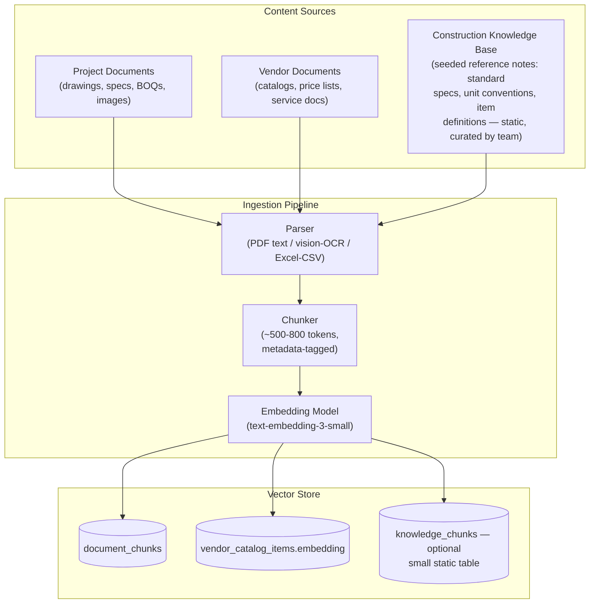
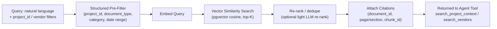

# 6. RAG Architecture

## 6.1 Three Kinds of Information — Explicit Separation

| Type | What it is | Where it lives | Retrieved how |
|---|---|---|---|
| **Structured data** | `projects`, `boq_items`, `estimates`, `vendor_catalog_items` (non-text fields), `rfqs`, `quotations` | PostgreSQL relational tables | Direct SQL queries with filters/joins — no LLM needed |
| **Documents (raw + parsed)** | Uploaded PDFs/images/Excel files and their parsed text/tables | Object storage (raw file) + `document_chunks`/`vendor_documents`-derived chunks (parsed text) | Fetched by `document_id`, or chunk-by-chunk via retrieval |
| **Vector/semantic information** | Embeddings of document chunks and vendor catalog items | `document_chunks.embedding`, `vendor_catalog_items.embedding` (pgvector) | Cosine-similarity search, always combined with structured filters (hybrid retrieval) |

This separation is intentional: **structured facts are never "retrieved" via embeddings** (e.g., "what is the project's budget cap" is a direct SQL lookup on `projects.budget_cap`, not a RAG query). RAG is reserved for unstructured content: document text, specs, catalog descriptions, and construction knowledge notes.

## 6.2 Sources Feeding the RAG Layer



## 6.3 Chunking Strategy

- **PDF/drawings (text-based):** split by page, then by paragraph/section heading if detectable; target 500–800 tokens per chunk with ~50-token overlap.
- **PDF/drawings (scanned/image-based):** run OCR or GPT-4o vision to produce text + bounding-box/region description, then chunk the same way; each chunk retains a reference to the source page/region for citation.
- **Excel/CSV BOQs and catalogs:** chunk **row-group-wise**, not by raw token count — e.g., group by sheet + a natural block of rows (a table section), so a retrieved chunk represents a coherent set of line items rather than an arbitrary text slice. Each row also becomes a structured `vendor_catalog_items` row in parallel (structured + semantic dual representation).
- **Metadata tagged per chunk:** `document_id`, `page_number`/`sheet_name`, `row_range` (if tabular), `section_heading` (if detectable), `document_type`.

## 6.4 Hybrid Retrieval



Retrieval is never "vector search alone": every call to `HybridRetriever.search()` requires at least a `project_id` (for project documents) or a `category`/`published` filter (for vendor catalog search) before the vector step runs. This directly reflects the product requirement that vendor matching must combine structured filtering with semantic matching, not vector similarity alone.

```python
class HybridRetriever:
    def search(self, query: str, filters: dict, k: int = 8) -> list[RetrievedChunk]:
        candidates = self._structured_prefilter(filters)   # SQL WHERE clause
        query_embedding = embedding_client.embed(query)
        ranked = self._vector_search(candidates, query_embedding, k)
        return [self._attach_citation(c) for c in ranked]
```

## 6.5 Source / Citation Tracking

Every retrieved chunk carries a `Citation` object all the way through the agent to the final answer and into persisted records:

```python
class Citation(BaseModel):
    document_id: str
    document_name: str
    location: str          # "page 4" or "sheet 'Materials' rows 12-18"
    chunk_id: str
    similarity_score: float | None
```

- `extracted_requirements.source_document_id` + `source_chunk_id` persist this at the database level (see [04-database-design.md](./04-database-design.md)).
- `boq_items.calculation_trace` includes the `source_requirement_ids`, which transitively link back to citations.
- The UI shows a small "source" chip on any AI-derived value ("from `drawing_A3.pdf`, page 4") — this is the concrete, demoable version of the audit trail requirement.
- `audit_logs.source_reference` stores the same citation string for anything AI-derived, independent of which table the value ended up in.

## 6.6 Construction Knowledge Base (Scoped Down for MVP)

Rather than building a general construction-knowledge RAG system (which is a research project on its own), the MVP knowledge base is a **small, curated, static set of reference notes** — standard unit definitions, common item categories, typical waste-factor percentages for the limited material set the MVP supports. This is stored the same way as any other document source (parsed → chunked → embedded into a `knowledge_chunks` table or simply tagged rows within `document_chunks` with `document_type='knowledge_base'`), so the same `HybridRetriever` code path handles it — no separate subsystem needed. Expanding this into a comprehensive construction codes/standards knowledge base is explicitly a future extension (see [10-final-scope.md](./10-final-scope.md)).

## 6.7 Vendor Semantic Retrieval

Vendor catalog items are embedded once at publish time (and re-embedded on correction). A customer requirement (e.g., "60mm ceramic floor tiles, matte finish") is embedded at query time and compared only within the subset of `vendor_catalog_items` that already passed the `StructuredFilter` (category = flooring, `is_published = true`, quantity available, price within budget). This ordering — filter first, embed/rank second — is what the Vendor Matching Engine ([03-lld.md §3.7](./03-lld.md)) relies on and is repeated here because it is the same `HybridRetriever` mechanism reused for a different domain (vendor items instead of project documents).

Continue to [07-development-plan.md](./07-development-plan.md) for how this is built over the project timeline.
