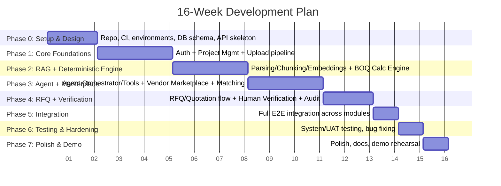
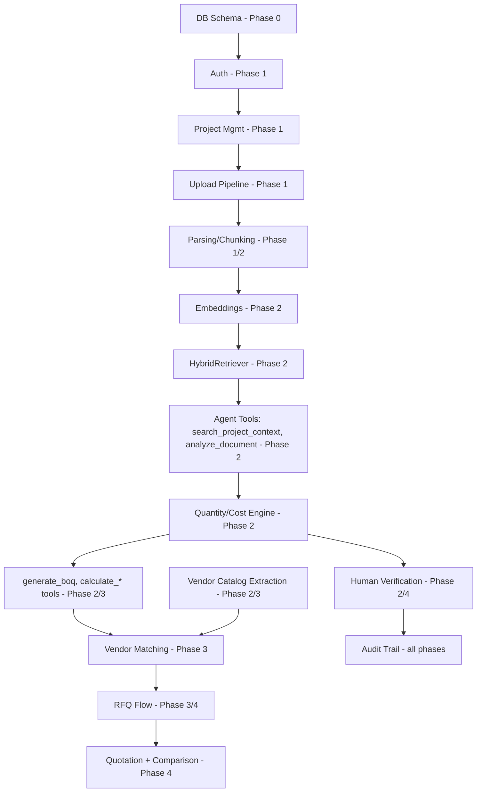

# 7. Development Plan

**Duration:** 16 weeks (4 months), 4 team members. **Team roles** (fixed for the whole project to build depth, with pairing for integration weeks):

- **A — Frontend Lead:** customer workspace UI, vendor portal UI, agent chat UI, verification UI.
- **B — Backend Core Lead:** Auth, Project Management, Vendor Marketplace, RFQ & Quotation, Audit Trail, deployment/infra.
- **C — Document Processing & RAG Lead:** upload pipeline, parsers, chunking, embeddings, `HybridRetriever`.
- **D — Agent & Estimation Lead:** `AgentOrchestrator`, `ToolRegistry`, BOQ & Estimation Engine (deterministic calc), Vendor Matching Engine.

## 7.1 Phase Overview

## 7.2 Week-by-Week Breakdown

### Phase 0 — Setup & Design Finalization (Weeks 1–2)

| Week | A (Frontend) | B (Backend Core) | C (Docs/RAG) | D (Agent/Estimation) |
|---|---|---|---|---|
| 1 | Project scaffold (React+Vite+Tailwind), design system, page routing skeleton | Repo setup, Docker Compose (Postgres+pgvector, Redis, MinIO), CI skeleton, FastAPI app skeleton | Finalize document type list & sample test documents (2–3 real-ish drawings/BOQs) | Finalize `reference_items`/`reference_rates` seed list (limited MVP material set), formula definitions |
| 2 | Wireframes for all main screens (project, upload, BOQ, verification, marketplace, RFQ) | DB migrations for all tables in [04-database-design.md](./04-database-design.md); Auth module (register/login/JWT) | Prototype PDF + Excel parsers standalone (no API yet) | Draft tool schemas for all 8 agent tools; prototype LLM function-calling with a mock tool |

**Deliverable:** Running skeleton (empty screens hitting a real auth'd API), full DB schema migrated, all four members have a working local dev environment (`docker-compose up`).

### Phase 1 — Core Foundations (Weeks 3–5)

| Week | A | B | C | D |
|---|---|---|---|---|
| 3 | Project CRUD screens (create/list/detail) wired to API | Project Management module (CRUD API) | Document upload API (multipart) + object storage integration | Design `Tool` interface + `ToolRegistry`; stub `AgentOrchestrator` loop (no real LLM calls yet, echo tool) |
| 4 | Upload UI (drag/drop, status polling) | Vendor registration + profile CRUD | Celery worker wiring; `PdfTextParser`, `ExcelCsvParser` implemented and tested | `search_project_context` tool implemented against a temporary keyword search (placeholder for real RAG) |
| 5 | Document list/status UI; basic project dashboard | Audit Trail module (`AuditLogger`) wired into Auth/Project events | `ImageVisionParser` (GPT-4o vision) + `Chunker` with metadata tagging | Integrate real LLM client (`LLMClient` interface + OpenAI implementation) |

**Integration checkpoint (end of Week 5):** A user can register, create a project, upload a PDF/Excel/image, and see it move from `pending → processing → processed` with parsed chunks visible in a debug view.

### Phase 2 — RAG + Deterministic Estimation Engine (Weeks 6–8)

| Week | A | B | C | D |
|---|---|---|---|---|
| 6 | BOQ/estimate view UI (table with quantities, costs, confidence badges) | Vendor document upload API (reuses Document Processing) | `EmbeddingService` + pgvector storage/index; embedding generation job | `QuantityCalculator` (area/volume/count/length formulas) with unit tests |
| 7 | Agent chat UI (basic send/receive, shows tool-call trace for debugging) | `CatalogExtractionService` + `CatalogStandardizer` for vendor catalogs | `HybridRetriever` (structured pre-filter + pgvector similarity + citation attach) | `CostCalculator` using `reference_rates`; `ConfidencePropagator` + `uncertainty_flags` writing |
| 8 | Verification queue UI (list open flags, correct/approve/reject actions) | Vendor catalog review/publish endpoints | Swap `search_project_context` tool to real `HybridRetriever`; write retrieval quality test set (10–15 sample queries with expected chunks) | `analyze_document` and `generate_boq` tools implemented, calling C's retriever + D's calculators |

**Integration checkpoint (end of Week 8):** End-to-end customer flow works: upload → agent extracts requirements → generates BOQ → calculates quantities/costs → low-confidence items appear as flags → user can correct them via the Verification UI.

### Phase 3 — Agent Orchestration + Marketplace + Matching (Weeks 9–11)

| Week | A | B | C | D |
|---|---|---|---|---|
| 9 | Marketplace browse UI (vendor catalog search/filter) | RFQ creation API skeleton (`rfqs`, `rfq_line_items`) | Vendor catalog embedding refresh on correction; retrieval quality tuning | `StructuredFilter` + `SemanticRanker` + `MatchScorer` (Vendor Matching Engine) |
| 10 | Vendor match results UI (ranked list with score + rationale + source spec) | Quotation submission API (vendor side) | Support agent's `search_vendors` tool with structured filter params from UI | `search_vendors` tool wired to Matching Engine; full planning loop with real multi-step tool sequences |
| 11 | RFQ creation UI (select BOQ items + vendors) + vendor RFQ inbox UI | Notification stub (in-app notification rows on RFQ create) | Support/debug retrieval edge cases found during integration | `compare_quotations` tool (deterministic diff + LLM narrative); `request_human_verification` tool finalized |

**Integration checkpoint (end of Week 11):** Full agent tool set operational; a customer can go from upload → BOQ → vendor matches → RFQ creation in one session; vendor can view RFQ inbox.

### Phase 4 — RFQ Completion + Human Verification Polish + Audit (Weeks 12–13)

| Week | A | B | C | D |
|---|---|---|---|---|
| 12 | Quotation comparison UI (table + AI summary) | Approval workflow API (`approvals`), recalculation trigger on correction | Support any remaining vendor-side extraction quality fixes | Progressive refinement: verify agent re-reads latest state correctly after corrections; escalation logic hardening |
| 13 | Audit trail viewer UI (per-project timeline) | Audit log completeness pass across all modules; role-based access review | Regression pass on parsing/retrieval with the full sample document set | Agent run history UI backend (`agent_runs`/`agent_tool_calls` list endpoints) |

**Integration checkpoint (end of Week 13):** Full pipeline complete end-to-end for both customer and vendor workflows, including audit trail visibility.

### Phase 5 — Full Integration (Week 14)

All four members work across modules together: fix integration bugs, align error handling/status codes, confirm every sequence diagram in [03-lld.md](./03-lld.md) works against the real system, seed realistic demo data (2–3 projects, 4–5 vendors with catalogs).

### Phase 6 — Testing & Hardening (Week 15)

Execute the plan in [09-testing-plan.md](./09-testing-plan.md): unit test gaps filled (especially `QuantityCalculator`/`CostCalculator`), integration test suite run, manual UAT walkthrough of both workflows, bug triage and fixes, performance sanity check (upload → BOQ turnaround time).

### Phase 7 — Polish & Demo Prep (Week 16)

UI polish pass, confidence/citation display consistency check, prepare demo script covering: vendor onboarding → customer upload → AI estimate with visible uncertainty → human correction → vendor matching → RFQ → quotation comparison → final selection. Prepare architecture presentation using the diagrams in this `/docs` folder directly.

## 7.3 Dependency Summary

## 7.4 Parallelization Strategy

- **Weeks 1–5:** Near-fully parallel — each member owns a distinct vertical slice with only DB schema as a shared dependency (locked in Week 2).
- **Weeks 6–11:** A and C/D become more coupled (frontend needs real tool outputs to build against) — mitigate with mocked API responses (OpenAPI contracts agreed in Phase 0) so A never blocks on D/C's actual implementation.
- **Weeks 12–16:** Convergence — all four work across module boundaries, pairing for integration and bug-fixing rather than owning strict verticals.

Continue to [08-estimation-plan.md](./08-estimation-plan.md) for effort sizing and scope classification.
