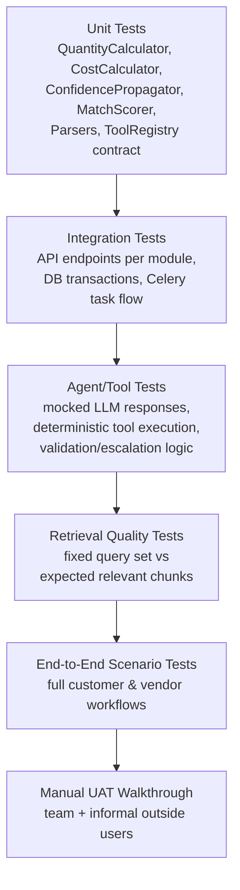

# 9. Testing Plan

## 9.1 Testing Strategy by Layer

## 9.2 Unit Testing (continuous, from Phase 1 onward)

| Target | What's tested | Owner |
|---|---|---|
| `QuantityCalculator` | Each formula (area, volume, count, length) against known inputs/outputs; missing-input handling flags rather than crashes | D |
| `CostCalculator` | Correct rate lookup, correct total sums, behavior when no `reference_rates` row exists | D |
| `ConfidencePropagator` | Threshold logic, correct `uncertainty_flags` creation on low confidence/missing/conflicting inputs | D |
| Parsers (`PdfTextParser`, `ExcelCsvParser`, `ImageVisionParser`) | Correct text/row extraction on sample fixture files; graceful failure on corrupt/unsupported files | C |
| `Chunker` | Correct chunk boundaries, metadata attached, no data loss between original and reconstructed chunks | C |
| `StructuredFilter` / `MatchScorer` | Correct filtering on category/spec/quantity/budget; score computation deterministic given fixed inputs | D |
| `AuditLogger` | Every call produces a row with required fields populated | B |
| Auth/JWT | Token issuance, expiry, role guard rejects wrong-role access | B |
| `ToolRegistry` contract | Every registered tool conforms to the `Tool` protocol (schema present, `execute` callable, returns `ToolResult`) | D |

**Target coverage:** deterministic modules (calculation engine, matching filters, parsers) should aim for high coverage (~80%+) since these are the "correctness-critical, no LLM randomness" parts of the system and are the easiest to test meaningfully.

## 9.3 Integration Testing (Phases 2–5, expanding as modules land)

- Full request/response tests for every REST endpoint listed in [03-lld.md](./03-lld.md), using a test database (Postgres test container) — not mocks — so real SQL/pgvector behavior is exercised.
- Upload → Celery task → DB state transition tests (`pending → processing → processed`), including a forced-failure case (`processed → failed` with corrupt file fixture).
- Cross-module tests: correcting a `boq_item` via Human Verification triggers correct recalculation into `estimate_line_items`.
- RFQ lifecycle test: create RFQ → submit quotation → compare → select → status transitions correct at every step.

## 9.4 Agent & Tool Testing

Since LLM output is non-deterministic, agent tests are split:

1. **Tool-level tests (deterministic, no LLM):** call each tool's `execute()` directly with fixed inputs, assert on `ToolResult` — this covers `generate_boq`, `calculate_quantities`, `calculate_costs`, `search_vendors`, `compare_quotations`, `request_human_verification` fully without needing the LLM.
2. **Orchestrator tests with a mocked LLM client:** inject a fake `LLMClient` that returns scripted tool-call decisions, and assert the `AgentOrchestrator` calls the right tools in the right order, persists `agent_tool_calls`, and escalates correctly when a scripted tool result has low confidence.
3. **Smoke tests with the real LLM (small number, run manually/CI-optional due to cost/latency):** a handful of realistic prompts against a real project run end-to-end, checked for reasonable tool sequences and non-crashing behavior, not exact output matching.

## 9.5 RAG / Retrieval Quality Testing

- Maintain a fixed set of ~15–20 (query, project_id, expected relevant chunk IDs) pairs built from the sample documents used in Phase 0.
- Metric: **recall@k** (is at least one expected chunk in the top-k results?) — simple, appropriate for an MVP, avoids over-engineering evaluation.
- Re-run this set after any change to chunking strategy, embedding model, or retriever filter logic (regression check).
- Vendor catalog retrieval gets its own small test set (query = a customer-style requirement phrase, expected = specific catalog items known to match).

## 9.6 End-to-End Scenario Tests

| Scenario | Steps Verified |
|---|---|
| Full customer estimation | Upload → parse → agent extraction → BOQ → quantities/costs → uncertainty flags appear |
| Full vendor onboarding | Register → profile → upload catalog → extraction → review/correct → publish |
| Vendor matching | Given a BOQ item, matched vendors respect structured filters (category/budget/location) AND are ranked sensibly by similarity |
| RFQ → Quotation → Comparison | RFQ created from BOQ → 2+ vendors submit quotations → comparison shows correct diffs and a coherent summary |
| Human verification loop | A flagged item is corrected → downstream estimate updates → audit log reflects the change with before/after values |
| Progressive refinement | Adding a second document to an existing project improves/updates requirements and BOQ without manual reset |

These map directly to the sequence diagrams in [03-lld.md §3.12](./03-lld.md), so passing these tests is equivalent to validating the LLD is actually implemented as designed.

## 9.7 Acceptance Criteria (per module, MVP definition of done)

- **Document Processing:** all three MVP file types parse without crashing on at least 3 representative sample files each; failures are surfaced as `status=failed`, not silent.
- **BOQ & Estimation Engine:** every `boq_item`/`estimate_line_item` has a non-null `calculation_trace`; no arithmetic is ever produced directly by an LLM response.
- **Agent:** every `agent_run` has at least one linked `agent_tool_calls` row when it produced a structured result (no "black box" answers).
- **Vendor Matching:** no match result is returned that fails a hard structured filter (e.g., over budget), even if semantically similar.
- **Human Verification:** every `uncertainty_flags` row is eventually resolvable through the UI (approve/reject/correct), and resolution updates the source record.
- **Audit Trail:** for every AI-derived value shown in the UI, a corresponding `audit_logs` row with `source_reference` exists.

## 9.8 Testing Schedule (tied to [07-development-plan.md](./07-development-plan.md))

| Development Phase | Testing Activity |
|---|---|
| Phase 1 (Wk 3–5) | Unit tests for Auth, parsers as they land |
| Phase 2 (Wk 6–8) | Unit tests for calculation engine; integration tests for upload/BOQ endpoints; start retrieval quality test set |
| Phase 3 (Wk 9–11) | Agent tool + orchestrator tests (mocked LLM); matching engine unit tests |
| Phase 4 (Wk 12–13) | RFQ/quotation integration tests; verification loop E2E test |
| Phase 5 (Wk 14) | Full E2E scenario suite run against integrated system; fix breakages |
| Phase 6 (Wk 15) | Dedicated bug-fixing sprint; manual UAT walkthrough by all 4 members playing customer/vendor roles; regression run of full test suite |
| Phase 7 (Wk 16) | Final smoke test pass immediately before demo; no new features, fixes only |

## 9.9 Test Data

- 2–3 sample "customer projects" with real-ish architectural/structural drawing PDFs, one Excel BOQ, and a couple of site photos (collected/created in Phase 0).
- 4–5 sample "vendor" catalogs across different categories (e.g., flooring, doors/windows, electrical fittings) in mixed formats (Excel, PDF, one scanned/image-based).
- Seeded `reference_items`/`reference_rates` for the MVP's limited material set (agreed in Phase 0 Week 1).

Continue to [10-final-scope.md](./10-final-scope.md) for the one-page executive summary.
